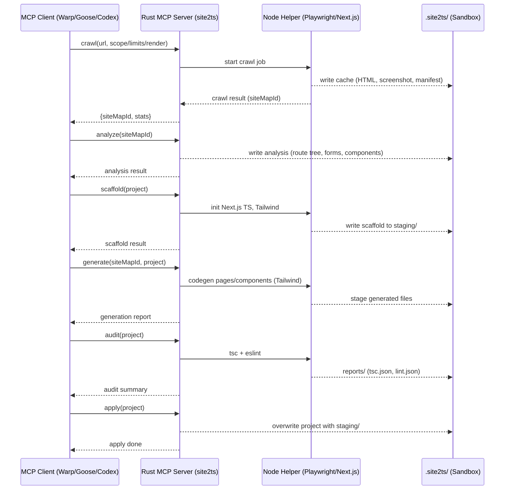

# Inqwise MCP Site2TS – Architecture Draft (MVP)

## 1. Overview
The **Site2TS MCP service** converts existing websites into TypeScript-based Next.js apps.
Implementation: **Rust MCP server** + **Node (Playwright/Next.js) helper**. ARM-first (macOS/Linux).

## 2. Core Components
- **Rust MCP Server**: JSON‑RPC over stdio; tools: crawl, analyze, scaffold, generate, assets, audit, diff, pack. Enforces sandbox at `.site2ts/`.
- **Node Helper**: Headless render (Chromium), scaffolding/build tasks. Sandboxed under `.site2ts/`. Node 20 LTS.

## 3. Filesystem Layout
.project-root/
  .site2ts/
    staging/     — persistent temp workspace (apply overwrites)
    cache/       — crawl artifacts (HTML, screenshots, HAR) — pruned by default
    reports/
      diff/<diffId>/<route>/{baseline.png, actual.png, diff.png, metrics.json, summary.json}
      improve/<jobId>.json — recorded `improve` requests for automation/audit
      tailwind/, tsc/, eslint/ … (per-tool artifacts)
    logs/        — NDJSON job logs

## 4. Diff Feedback Loop (MVP+)
- Diff tool writes structured summaries per route (heatmap + DOM zones) to aid automation.
- `tools/plan-improvements.js` parses the newest diff, cross-references past improvements, and suggests next actions/stop conditions.
- `improve` MCP method logs instructions (generationId, route, issue tags) for the orchestrator or humans to act on.
- External orchestrator (LLM or scripted policy) reads the summary payload, chooses an action, issues MCP commands, and reruns generate/diff until thresholds are satisfied.

## 5. MVP Decisions (snapshot)
- Headless rendering (Playwright/Chromium), filesystem-only cache.
- Persistent staging; explicit apply with overwrite.
- Manual audit (tsc + lint). Latest stable Next.js/TS pinned per-project at init.
- Full Tailwind conversion; full‑page visual diffs; tight default tolerance.
- No auth, no API client SDK in MVP. Strict prereqs (Node 20 LTS, npm, Playwright).

## 6. High‑level Flow (diagram placeholder)

## 7. Future Improvements (backlog)
- Hybrid CSS to Tailwind conversion (auto-suggest, human-approved batches).
- Optional auto-audit post generate/apply.
- Authentication support (cookie/session injection).
- SDK generation from HAR.
- Configurable artifact retention; centralized heavy-asset cache.
- Node 22 LTS testing; privileged helper mode for Linux deps.

## 8. MVP Scope Boundaries
Out of scope: authenticated pages, API stubs, perf/a11y audits, automatic updates.
